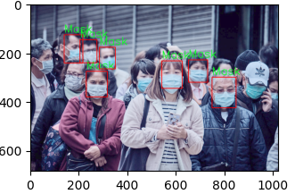

# Face Mask Detection


## Overview

This project aims to develop a robust face mask detection system using Convolutional Neural Networks (CNNs) to identify whether a person is wearing a face mask or not. The project is implemented using TensorFlow and Keras, leveraging a dataset of labeled images to train the model.



## Table of Contents

- [Introduction](#introduction)
- [Architecture](#architecture)
- [Installation](#installation)
- [Dataset](#dataset)
- [Training](#training)
- [Results](#results)
- [Project Paper](#paper)
- [Contact](#contact)

## Introduction

In response to the COVID-19 pandemic, wearing face masks has become a crucial preventive measure. This project seeks to automate the process of detecting face masks in real-time using machine learning techniques, contributing to public health and safety measures.

## Architecture

The model architecture for this project consists of several convolutional layers followed by max-pooling layers, dropout layers, and fully connected layers. The architecture is designed to extract meaningful features from the images and make accurate predictions.

```python
from keras.models import Sequential
from keras.layers import Conv2D, MaxPooling2D, Flatten, Dropout, Dense

model = Sequential()

model.add(Conv2D(32, (3, 3), padding='same', activation='relu', input_shape=(124, 124, 3)))  # First convolutional layer
model.add(Conv2D(64, (3, 3), activation='relu'))  # Second convolutional layer
model.add(Conv2D(128, (3, 3), activation='relu'))  # Third convolutional layer
model.add(MaxPooling2D(pool_size=(2, 2)))  # Max pooling layer
model.add(Dropout(0.25))  # Dropout layer

model.add(Flatten())  # Flatten layer
model.add(Dropout(0.5))  # Dropout layer
model.add(Dense(50, activation='relu'))  # Fully connected layer
model.add(Dropout(0.5))  # Dropout layer
model.add(Dense(1, activation='sigmoid'))  # Output layer

model.compile(loss='binary_crossentropy', optimizer='adam', metrics=['accuracy'])
```

## Installation

To run this project, you'll need to have Python and the following libraries installed:

TensorFlow
Keras
NumPy
OpenCV
scikit-learn

You can install the necessary dependencies using the following command:

``pip install tensorflow keras numpy opencv-python scikit-learn
``
## Dataset

The dataset consists of images of people with and without face masks, annotated with bounding boxes. The data is split into training and validation sets to evaluate the performance of the model.

## Training

The model is trained using an ImageDataGenerator to augment the data and improve generalization. The training process involves multiple epochs with steps per epoch calculated based on the batch size and the size of the training set.
```python
from keras.preprocessing.image import ImageDataGenerator
from sklearn.model_selection import train_test_split

xtrain, xval, ytrain, yval = train_test_split(X, Y, train_size=0.8, random_state=0)
datagen = ImageDataGenerator(
    rotation_range=15,
    width_shift_range=0.1,
    height_shift_range=0.1,
    horizontal_flip=True
)
datagen.fit(xtrain)

history = model.fit(
    datagen.flow(xtrain, ytrain, batch_size=32),
    steps_per_epoch=xtrain.shape[0] // 32,
    epochs=50,
    validation_data=(xval, yval)
)
```
## Results

The model achieved an accuracy of 94% on the validation set, demonstrating its ability to effectively distinguish between images of people with and without face masks.

## Paper

Here is a link to our paper covering a holistic overview on the background, methodology, and results of the project:
https://github.com/Solanki-Raja/Face_Mask_Detection_CNN/blob/main/Real-Time%20Face%20Mask%20Detection.pdf

Explore our comprehensive paper detailing the background, methodology, and results of the Real-Time Face Mask Detection project [here](https://github.com/Solanki-Raja/Face_Mask_Detection_CNN/blob/main/Real-Time%20Face%20Mask%20Detection.pdf).

## Contact

If you have any questions or suggestions, feel free to reach out to us:

**Connect with us on LinkedIn**

<div style="display: flex; align-items: center; justify-content: space-between;">
  <div style="text-align: center; margin: 10px;">
  
    <p><a href="https://www.linkedin.com/in/solankiraja/" target="_blank">Raja Solanki</a></p>
  </div>
  <div style="text-align: center; margin: 10px;">
      
    <p><a href="https://www.linkedin.com/in/james-hopham-2440352a5/" target="_blank">James Hopham</a></p>
  </div>
</div>


